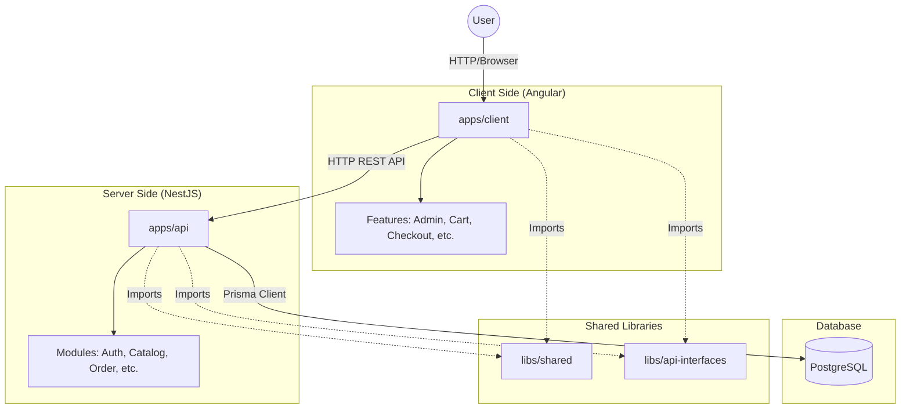

# Project Architecture

## Overview

This project is a full-stack e-commerce application organized as a monorepo using [Nx](https://nx.dev). It consists of an Angular frontend, a NestJS backend, and shared libraries.

## Technology Stack

*   **Monorepo Tool:** Nx
*   **Frontend:** Angular, Tailwind CSS
*   **Backend:** NestJS
*   **Database:** PostgreSQL, Prisma ORM
*   **Testing:** Cypress (E2E), Vitest (Unit)
*   **Containerization:** Docker

## Architecture Diagram

## Application Structure

### 1. Frontend (`apps/client`)
The client application is built with Angular. It is structured into feature modules:
*   **Admin**: Administrative dashboard.
*   **Auth**: User authentication (login/register).
*   **Cart/Checkout**: Shopping cart and order placement logic.
*   **Product/Catalog**: Product browsing and details.
*   **Profile**: User profile management.

### 2. Backend (`apps/api`)
The backend is a NestJS application providing a RESTful API. Key modules include:
*   **Auth**: JWT-based authentication and authorization.
*   **Catalog**: Management of Products, Categories, and Packs.
*   **Order**: Order processing and management.
*   **Upload**: File upload handling (using Multer).
*   **Database**: Prisma integration.

### 3. Database
The application uses PostgreSQL with Prisma ORM. Key entities defined in `prisma/schema.prisma` include:
*   `User`: Customers and Admins.
*   `Product`, `Category`: Catalog items.
*   `Pack`: Bundles of products.
*   `Order`, `OrderItem`: Transactional data.
*   `Cart`, `CartItem`: Shopping cart state.

### 4. Shared Libraries
*   `libs/api-interfaces`: Contains TypeScript interfaces and DTOs shared between the frontend and backend to ensure type consistency.
*   `libs/shared`: Contains shared utilities and constants (e.g., governorates list).
